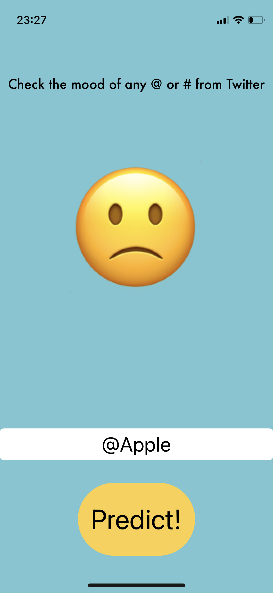

# 🙂 twitter-sentiment-analyzer 
An app that is able to check people's moods in an individual # or @ on Twitter. This is done by analyzing the last 100 posts on the dashboard, categorizing them as bad, neutral or good.

**This app uses:** 
- MVC
- CoreML
- Cocoapods
- Twitter API
- SwifteriOS
- SwiftyJSON

**Screenshots:** 
      
